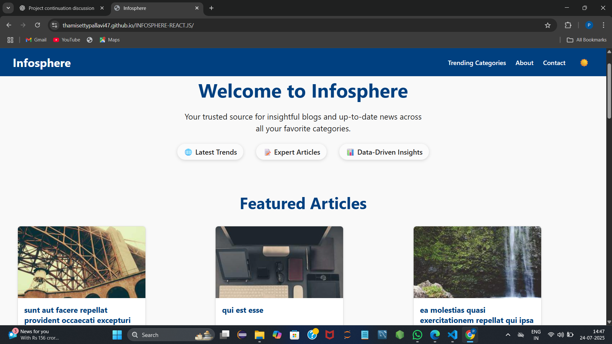
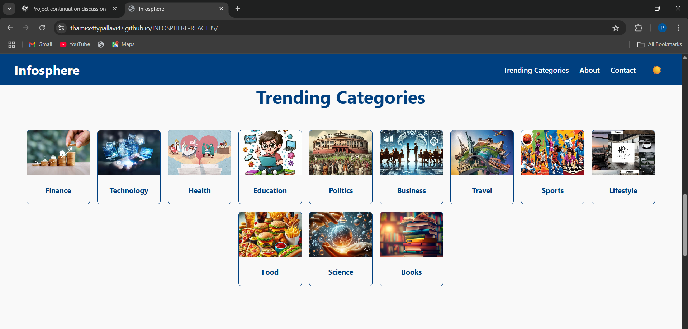
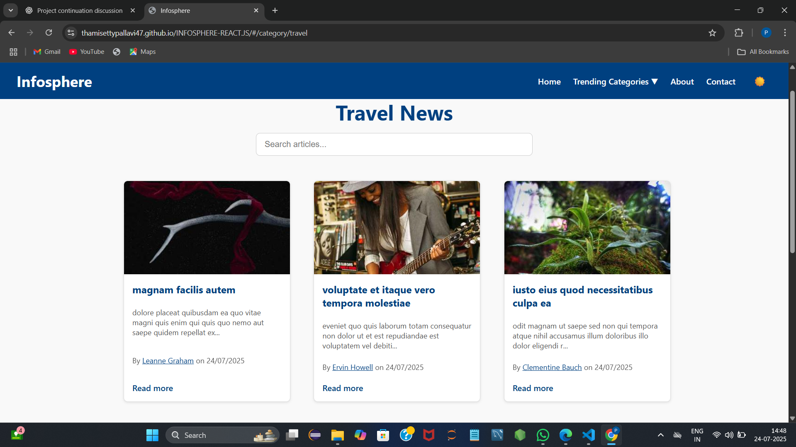
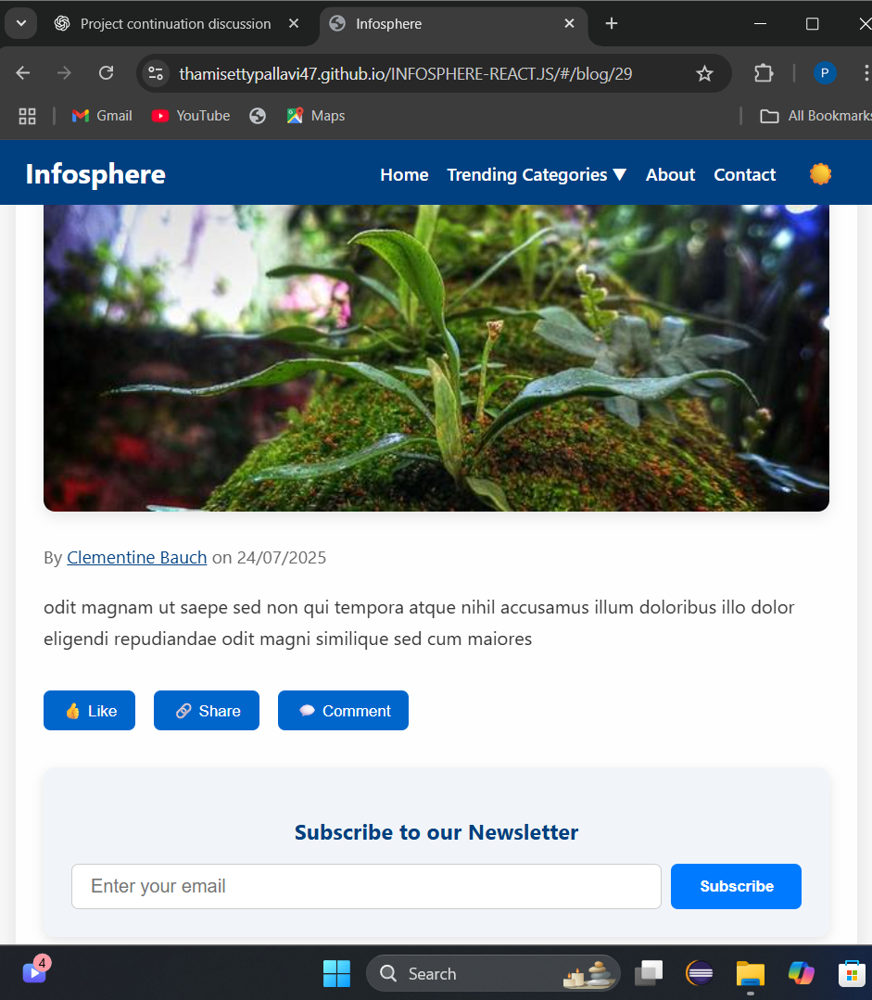
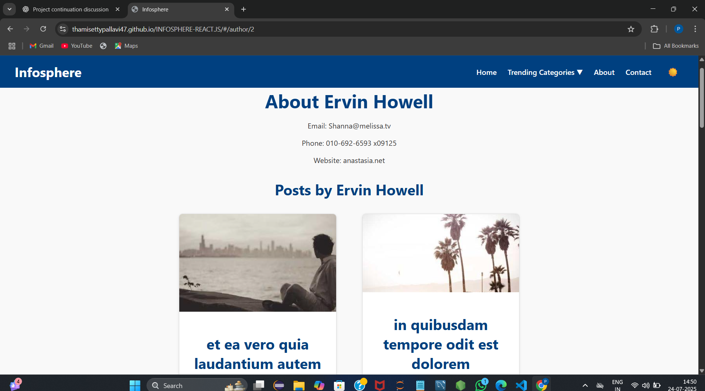
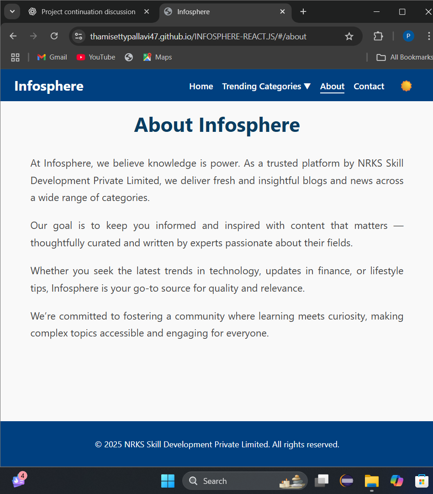
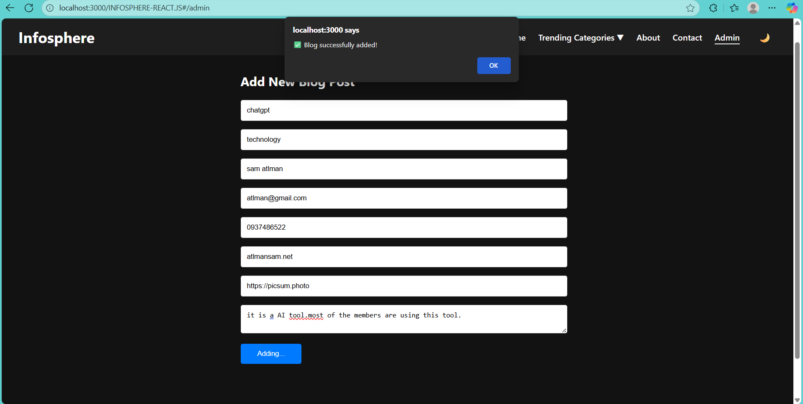
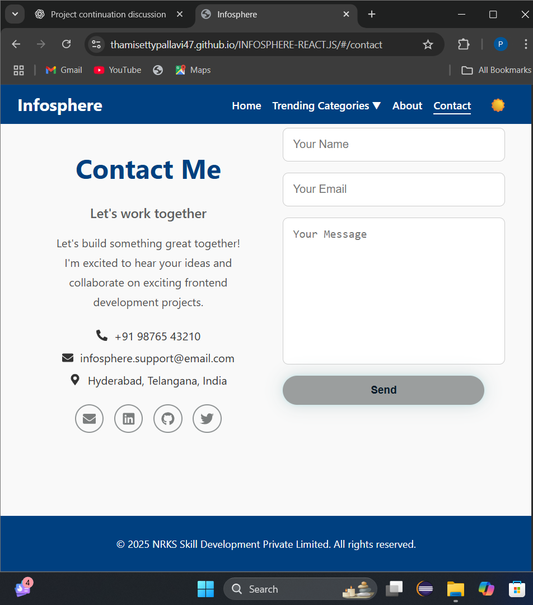

# 📰 Infosphere – React.js Blog/News Platform

Welcome to **Infosphere**, a responsive and visually appealing **blog/news website** built using **React.js**.  
It supports blog categories, featured articles, article details, and includes bonus features like search, pagination, dark/light mode, and contact form integration via **EmailJS**.

---

## 🌐 Live Demo

🚀 **Hosted on GitHub Pages:**   
🔗 [https://github.com/ThamisettyPallavi47/INFOSPHERE-REACT.JS/](https://thamisettypallavi47.github.io/INFOSPHERE-REACT.JS/)

---

## ✨ Features

- 🧭 **Homepage Sections**
  - Welcome Banner
  - Featured Articles
  - Trending Categories
- 📑 **Category Pages**
  - List of blog/news posts filtered by category
  - Search functionality (title/keyword-based)
- 📝 **Blog Post Details Page**
  - Full blog post content (image, title, date, author)
  - Related posts section 
- 👤 **Author Page** 
  - Posts by the same author
 -🛠️ **Admin Dashboard**
  - Add new blog posts (with Node.js backend)
  - View and manage existing posts
  - Simple and clean interface for admin controls
- 🌘 **Dark/Light Mode Toggle**
- ❤️ **Like, Share, Comment UI** (no backend, UI only)
- 🔍 **Search Bar** to find blog posts by keyword
- 📄 **Pagination / Load More** on blog list
- 💌 **Newsletter Subscription Form** (dummy UI)
- 📬 **Contact Form using EmailJS** – no backend required
- 📱 **Responsive Design** – Mobile-friendly layout

---

## 📸 Screenshots

> Store images in `/screenshots/` and update links accordingly.

### 🏠 Home Page


### 🏠 Home Page


### 📚 Category Page


### 📰 Blog Details Page


### 👩‍🦰 Author Page


### 📖 About Page


### 📬 Admin Page


### 📬 Contact Page


---

## 🛠️ Technologies Used

| Category             | Tools/Technologies                          |
|----------------------|---------------------------------------------|
| **Frontend**         | React.js, JSX, Functional Components        |
| **Styling**          | HTML5, CSS3, Custom Media Queries           |
| **Routing**          | React Router DOM                            |
| **Icons**            | React Icons                                 |
| **Animations**       | Framer Motion                               |
| **Email Support**    | EmailJS (No backend required)               |
| **Search/Pagination**| React state filtering & dynamic rendering  |
| **Version Control**  | Git + GitHub                                |
| **Deployment**       | Netlify / GitHub Pages / Vercel             |

---

## 🧪 Run Locally

### 🔹 Frontend

```bash
# 1. Clone the repo
git clone https://github.com/ThamisettyPallavi47/INFOSPHERE-REACT.JS

# 2. Navigate into the project folder
cd infosphere

# 3. Install dependencies
npm install

# 4. Start development server
npm start
```

### 🔹 Backend

```bash
# 1. Open a new terminal
# 2. Navigate to the backend folder (create one if not already done)
cd backend

# 3. Install backend dependencies
npm install

# 4. Start the backend server
node server.js

# Optional: Use nodemon for auto-restart during development
npx nodemon server.js
```


## 🚀 Deploying to GitHub Pages
1. Install `gh-pages` (if you haven’t already):  

```bash
npm install gh-pages --save-dev
```
2.Update your package.json file:

```json
"homepage": "https://thamisettypallavi47.github.io/INFOSPHERE-REACT.JS/",
```
```json
"scripts": {
  "predeploy": "npm run build",
  "deploy": "gh-pages -d build"
  
}

```

3.Build and deploy your app:

```bash
  npm run build
  npm run deploy
```
